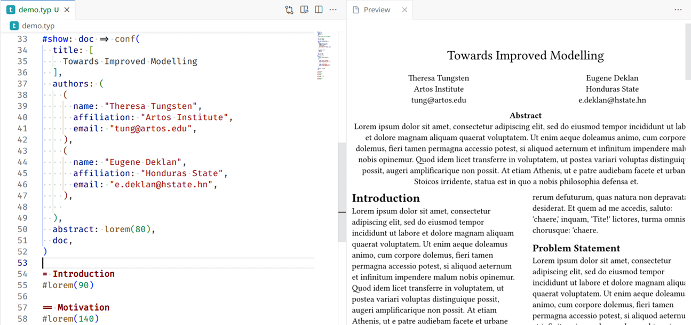

# [DEPRECATION NOTICE] Typst preivew extension has been integrated into [tinymist](https://github.com/Myriad-Dreamin/tinymist)

We recommend all users migrate to tinymist for the following benefits:

- More centralized resource management
- Reduced redundancy and lower resource usage
- Easier updates and maintenance

This repository will no longer be updated in future. All development will move to tinymist. Thank you for your support and understanding!

- We still maintain the typst-preview extension for a while in a best effort way.
   - The lazy people can continue using their setting, as all old things are still working.
   - This respect people who love minimal env, like a treesitter plugin plus preview.
- Tinymist will ensure compatibility to typst-preview as much as possible.
   - for vscode users: uninstall the preview extension and install the tinymist extension.
   - for standalone cli users: `typst-preview -> tinymist preview`

# [Typst Preview VSCode](https://github.com/Enter-tainer/typst-preview)

Preview your Typst files in vscode instantly!

## Features

- Low latency preview: preview your document instantly on type. The incremental rendering technique makes the preview latency as low as possible.
- Open in browser: open the preview in browser, so you put it in another monitor. https://github.com/typst/typst/issues/1344
- Cross jump between code and preview: We implement SyncTeX-like feature for typst-preview. You can now click on the preview panel to jump to the corresponding code location, and vice versa.

Install this extension from [marketplace](https://marketplace.visualstudio.com/items?itemName=mgt19937.typst-preview), open command palette (Ctrl+Shift+P), and type `>Typst Preview:`.

You can also use the shortcut (Ctrl+K V).

For more information, please visit documentation at [Typst Preview Book](https://enter-tainer.github.io/typst-preview/).

## Extension Settings

See https://enter-tainer.github.io/typst-preview/config.html

## Bug report

To achieve high performance instant preview, we use a **different rendering backend** from official typst. We are making our best effort to keep the rendering result consistent with official typst. We have set up comprehensive tests to ensure the consistency of the rendering result. But we cannot guarantee that the rendering result is the same in all cases. There can be unknown corner cases that we haven't covered.

**Therefore, if you encounter any rendering issue, please report it to this repo other than official typst repo.**
## Known Issues

See [issues](https://github.com/Enter-tainer/typst-preview/issues?q=is%3Aissue+is%3Aopen+sort%3Aupdated-desc) on GitHub.

## Legal

This project is not affiliated with, created by, or endorsed by Typst the brand.

## Change Log

See [CHANGELOG.md](CHANGELOG.md)
